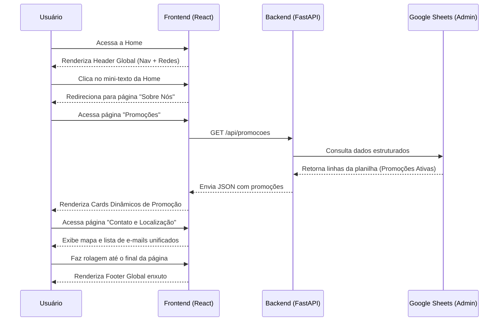

# 🚗 Amortecedores Tamura - Site Oficial (Refatoração)

> **Modernização, Performance e Autonomia** para a presença digital da oficina Amortecedores Tamura.

Este repositório contém o código-fonte da refatoração do site [amortecedorestamura.com](http://amortecedorestamura.com/). O projeto visa migrar a infraestrutura atual (Wix/Thunderbolt) para uma arquitetura moderna baseada em **React (Frontend)** e **FastAPI (Backend)**, focando em performance, componentização e gerenciamento dinâmico de conteúdo através do Google Sheets.

---

## 🎯 Objetivos do Projeto

- **Melhoria de UX/UI:** Navegação simplificada, design moderno com componentes globais (Header, Footer) e rotas unificadas para facilitar a jornada do cliente.
- **Autonomia Administrativa:** Sistema dinâmico de Promoções alimentado diretamente por uma planilha do Google Sheets, sem necessidade de deploy ou acesso ao código.
- **Performance & SEO:** Remoção do peso e bloqueios gerados por construtores visuais genéricos, além do uso agressivo de estratégias de cache.
- **Adequação Legal:** Inclusão clara de CNPJ, Política de Privacidade e Termos de Uso.

---

## 🛠️ Stack Tecnológica

### Frontend
- **Framework Principal:** React 18.3.1
- **Gerenciamento de Estado/Cache de API:** React Query / SWR (para chamadas assíncronas eficientes)
- **Estilização e Componentes:** Foco em *High-End Visual Design*, mantendo um sistema UI consistente e escalável.

### Backend
- **Framework:** FastAPI (Python)
- **Banco de Dados (CMS Leve):** Google Sheets API
- **Infraestrutura/Segurança:** `cachetools` (Cache em memória de 1h), `slowapi` (Rate-Limiting)

---

## 🏗️ Arquitetura e Estrutura de Páginas

A organização das rotas e páginas foi otimizada para reduzir a redundância do site antigo:

- **`/` (Home):** Visão geral da oficina, serviços principais e atalhos rápidos de conversão.
- **`/sobre-nos`:** A história da empresa (desmembrada e destacada da Home atual).
- **`/servicos`:** Hub de serviços em formato de cards visuais que direcionam para os detalhes (ex: Troca de Amortecedores, Alinhamento, etc.).
- **`/promocoes`:** Tela com dados gerados dinamicamente a partir do Google Sheets via API.
- **`/dicas`:** Unificação das antigas seções "Vai Viajar" e "Vídeos" em um só canal educativo.
- **`/faq`:** Perguntas frequentes com design responsivo e interativo (Accordion).
- **`/contato`:** Unificação de e-mails corporativos, telefones e mapa de localização.

---

## 🔒 Diretrizes de Segurança (Cybersecurity)

O sistema implementa rigorosas camadas de proteção, tanto no front quanto no backend:

### Backend
- **Proteção de Credenciais:** A API utiliza uma *Google Service Account* com escopo de leitura estritamente limitado. O arquivo `service_account.json` NUNCA deve ser commitado no repositório (protegido via `.gitignore`). Em ambiente de produção ou CI/CD, utilize a variável de ambiente `GOOGLE_CREDENTIALS_JSON` (contendo o conteúdo JSON das credenciais ou em formato Base64).
- **Rate-Limiting contra Abuso:** Implementação do middleware `slowapi` limitando requisições por IP (ex: 10 requisições/minuto), prevenindo DDoS na rota pública.
- **Controle de Origem (CORS):** A API bloqueia tentativas de consumo por sites terceiros, aceitando requisições configuradas na variável `ALLOWED_ORIGINS` (ex: `http://localhost:5173`).
- **Headers de Segurança & Erros:** Injeção dos cabeçalhos `X-Content-Type-Options`, `X-Frame-Options`, `Content-Security-Policy` e mascaramento de exceções internas em produção.
- **Cache Estratégico:** Uso do `cachetools` mitigando a latência do Google e impedindo que as cotas da API de planilhas sejam esgotadas.

### Frontend
- **Zero Credenciais Expostas:** O cliente não possui nenhum token ou segredo embarcado. Toda a comunicação com a "planilha" passa pelo backend seguro intermediário.
- **Tratamento Silencioso de Erros:** Se o Rate-Limit for atingido, o cliente receberá um aviso amigável na interface (*fallback*), sem expor rotas sensíveis, logs ou *status codes* técnicos.

---

## 🔄 Fluxo de Dados (Promoções Dinâmicas)

O diagrama de sequência abaixo demonstra o funcionamento do sistema em produção quando um cliente interage com as principais seções, em especial a busca de promoções ativas:

---

## 🚀 Como Executar Localmente

*(As instruções exatas de build e execução local serão consolidadas nesta seção assim que a arquitetura dos repositórios de Frontend e Backend for inicializada no disco.)*
